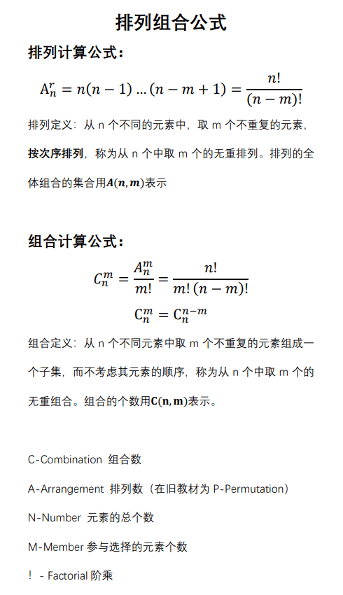

# 排列组合(Permutation and Combination)

> 概念：n 个不同元素中任意选取 m (m <= n) 个元素进行排列，所有排列情况的个数叫做 排列数，其值等于：

```math
A = n! / (n - m)!
```

排列组合是组合学最基本的概念。所谓排列，就是指从给定个数的元素中取出指定个数的元素进行排序。组合则是指从给定个数的元素中仅仅取出指定个数的元素，不考虑排序。

排列组合的中心问题是研究给定要求的排列和组合可能出现的情况总数。 排列组合与古典概率论关系密切。


