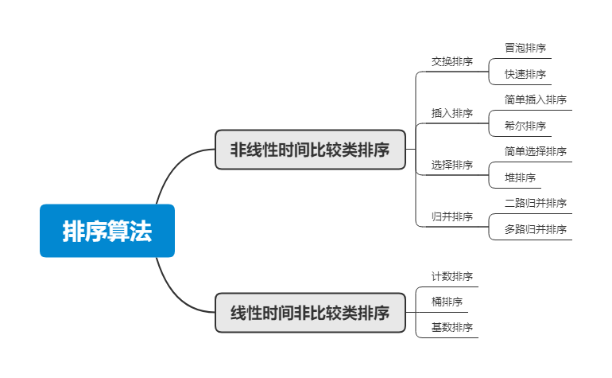
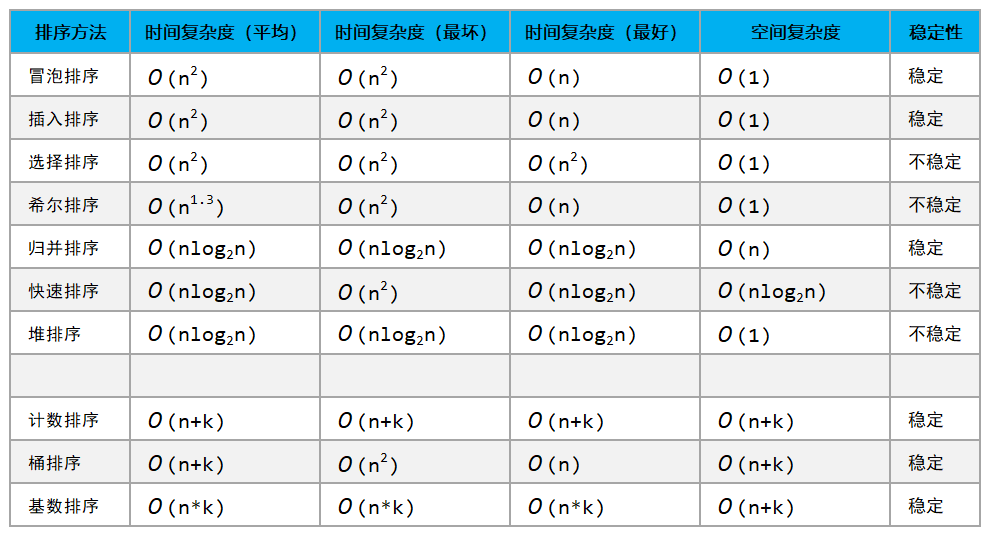

# 排序算法总结（JavaScript实现）




``` js
function swap(arr, i, j) {
  var temp = arr[i];
  arr[i] = arr[j];
  arr[j] = temp;
}

function swap(arr, i, j) {
  [arr[i], arr[j]] = [arr[j], arr[i]]
}
```

## 冒泡排序

**工作原理：**
> 重复地走访过要排序的数列，一次比较两个元素，如果它们的顺序错误就把它们交换过来。走访数列的工作是重复地进行直到没有再需要交换，也就是说该数列已经排序完成。这个算法的名字由来是因为越小的元素会经由交换慢慢“浮”到数列的顶端。

**过程描述：**
> 1. 比较相邻的元素。如果第一个比第二个大，就交换它们两个；
> 2. 对每一对相邻元素作同样的工作，从开始第一对到结尾的最后一对，这样在最后的元素应该会是最大的数；
> 3. 针对所有的元素重复以上的步骤，除了最后一个；
> 4. 重复步骤1~3，直到排序完成。

**动画图解：**


**代码示例：**
``` js
function bubbleSort(arr) {
  var len = arr.length;
  for (var i = 0; i < len - 1; i++) {
    for (var j = 0; j < len - 1 - i; j++) {
      if (arr[j] > arr[j + 1]) {
        swap(arr, j, j+1);
      }
    }
  }
  return arr;
}
```

## 插入排序
**工作原理：**
> 通过构建有序序列，对于未排序数据，在已排序序列中从后向前扫描，找到相应位置并插入。

**过程描述：**
> 1. 从第一个元素开始，该元素可以认为已经被排序；
> 2. 取出下一个元素，在已经排序的元素序列中从后向前扫描；
> 3. 如果该元素（已排序）大于新元素，将该元素移到下一位置；
> 4. 重复步骤3，直到找到已排序的元素小于或者等于新元素的位置；
> 5. 将新元素插入到该位置后；
> 6. 重复步骤2~5。

**动画图解：**


**代码示例：**
``` js
function insertionSort(arr) {
  const len = arr.length;
  let preIndex, current;
  for (let i = 1; i < len; i++) {
    preIndex = i - 1;
    current = arr[i];
    while (preIndex >= 0 && arr[preIndex] > current) {
      arr[preIndex + 1] = arr[preIndex];
      preIndex--;
    }
    arr[preIndex + 1] = current
  }
  return arr
}
```

## 选择排序

**工作原理：**
> 首先在未排序序列中找到最小（大）元素，存放到排序序列的起始位置，然后，再从剩余未排序元素中继续寻找最小（大）元素，然后放到已排序序列的末尾。以此类推，直到所有元素均排序完毕。 

**过程描述：**
> 1. 初始状态：无序区为R[1..n]，有序区为空；
> 2. 第i趟排序(i=1,2,3…n-1)开始时，当前有序区和无序区分别为R[1..i-1]和R(i..n）。该趟排序从当前无序区中-选出关键字最小的记录 R[k]，将它与无序区的第1个记录R交换，使R[1..i]和R[i+1..n)分别变为记录个数增加1个的新有序区和记录个数减少1个的新无序区；
> 3. n-1趟结束，数组有序化了。

**动画图解：**


**代码示例：**
``` js
function selectionSort(arr) {
  const len = arr.length
  let minIndex;
  for (let i = 0; i < len - 1; i++) {
    minIndex = i;
    for (let j = i + 1; j < len; j++) {
      if (arr[minIndex] > arr[j]) minIndex = j;
    }
    swap(arr, minIndex, i)
  }
  return arr
} 
```

## 希尔排序

**工作原理：**
> 希尔排序是Shell在1959年发明的，是简单插入排序的改进版。改进在于：它会优先比较距离比较远的元素。所以希尔排序又叫**缩小增量排序**。

**过程描述：**
> 先将整个待排序的记录序列分割成为若干子序列分别进行直接插入排序
> 1. 选择一个增量序列t1，t2，…，tk，其中ti>tj，tk=1；
> 2. 按增量序列个数k，对序列进行k 趟排序；
> 3. 每趟排序，根据对应的增量ti，将待排序列分割成若干长度为m 的子序列，分别对各子表进行直接插入排序。仅增量因子为1 时，整个序列作为一个表来处理，表长度即为整个序列的长度。

**动画图解：**


**代码示例：**
``` js
function shellSort(arr) {
  const len = arr.length;
  let h = 1;
  while (h < len / 3) h = 3 * h + 1;
  while (h >= 1) {
    for (let i = h; i < len; i++) {
      for (let j = i; j >= h && less(arr[j], arr[j - h]); j -= h) {
        swap(arr, j, j - h)
      }
    }
    h = Math.floor(h / 3);
  }
  return arr
}
```

## 归并排序

**工作原理：**
> 归并排序是采用 **分支法(Divide and Conquer)** 的典型应用。将已有序的子序列合并，得到完全有序的序列。即先使每个子序列有序，再使子序列段间有序。若将两个有序表合并成一个有序表，就称为 2-路归并。

**过程描述：**
> 1. 把长度为n的输入序列分成两个长度为n/2的子序列；
> 2. 对这两个子序列分别采用归并排序；
> 3. 将两个排序好的子序列合并成一个最终的排序序列。

**动画图解：**


**代码示例：**
``` js
function mergeSort(arr) {
  const len = arr.length
  if (len < 2) return arr;

  const middle = Math.floor(len / 2),
    left = arr.slice(0, middle),
    right = arr.slice(middle);
  return merge(mergeSort(left), mergeSort(right));
}

function merge(left, right) {
  const result = []
  while (left.length > 0 && right.length > 0) {
    if (left[0] > right[0]) {
      result.push(right.shift())
    } else {
      result.push(left.shift())
    }
  }

  while (left.length) {
    result.push(left.shift())
  }

  while (right.length) {
    result.push(right.shift())
  }

  return result
}
```

## 快速排序

**工作原理：**
> 快速排序是对冒泡排序的一种改进。通过一趟排序将要排序的数据分割成独立的两部分，其中一部分的所有数据都比另外一部分的所有数据都要小，然后再按此方法对这两部分数据分别进行快速排序，整个排序过程可以递归进行，以此达到整个数据变成有序序列。

**过程描述：**
> 快速排序使用分治法来把一个串 `(list)` 分为两个子串 `(sub-lists)`
> 1. 设定一个分界值。可以从数列中挑出一个元素，并且称为基准 `(pivot)` ，通过基准值将数组分成左右两部分；
> 2. 将大于或等于基准值的数据集中到数组右边，小于基准值的数据集中到数组的左边。此时，左边部分中各元素都小于或等于分界值，而右边部分中各元素都大于或等于基准值，这个称为分区 `(partition)` 操作；
> 3. 然后，左边和右边的数据可以独立排序。对于左侧的数组数据，又可以取一个分界值，将该部分数据分成左右两部分，同样在左边放置较小值，右边放置较大值。右侧的数组数据也可以做类似处理。
> 4. 重复上述过程。其实用的就是递归 `(recursive)`

**动画图解：**


**代码示例：**
``` js
function quickSort(arr, left, right) {
  var len = arr.length,
    partitionIndex,
    left = typeof left != 'number' ? 0 : left,
    right = typeof right != 'number' ? len - 1 : right;

  if (left < right) {
    partitionIndex = partition(arr, left, right);
    quickSort(arr, left, partitionIndex - 1);
    quickSort(arr, partitionIndex + 1, right);
  }
  return arr;
}

function partition(arr, left, right) {
  var pivot = left,
      slow = pivot + 1;
  for (var fast = slow; fast <= right; i++) {
    if (arr[fast] < arr[pivot]) {
      swap(arr, fast, slow);
      slow++;
    }
  }
  swap(arr, pivot, slow - 1);
  return slow - 1;
}
```
